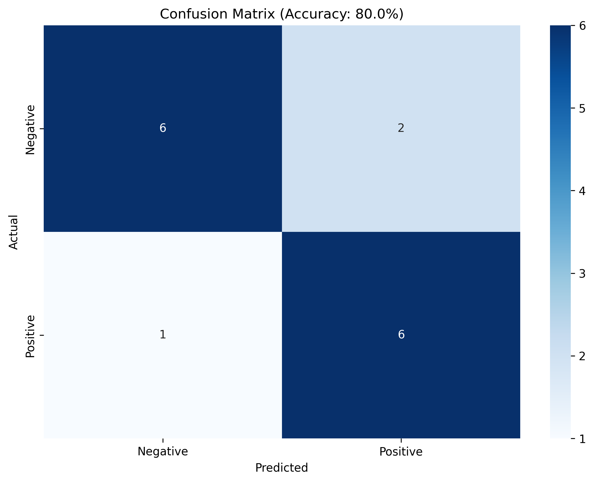

# AI-Powered Sentiment Analyzer

Machine learning project that analyzes customer review sentiment using Python and scikit-learn.

## Results
- **Accuracy:** 80% on test data
- **Model:** Naive Bayes classifier with TF-IDF vectorization
- **Dataset:** 50 balanced customer reviews

## Features
- Text preprocessing and tokenization
- Train/test split evaluation
- Confusion matrix visualization
- Real-time sentiment prediction with confidence scores

## Tech Stack
- Python
- scikit-learn
- Matplotlib, Seaborn
- NumPy, Pandas

## Run Locally
```bash
pip install -r requirements.txt
python3 simple_sentiment_analyzer.py

Results



Author: Mohamed Ismail
GitHub: @Moedub
Portfolio: moedub.github.io/portfolio
